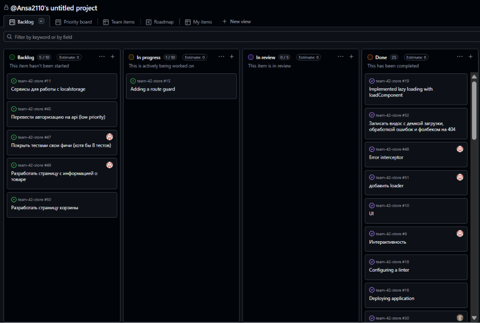

# Team42Store

## About the Project

Team 42 Store is a modern e-commerce web application built with Angular.  
Users can browse products, search and filter items, add products to the cart, place orders, and manage their profiles.

The project is developed as part of the RS School Angular Sprint and demonstrates the usage of modern Angular features and architecture.

---

## Team — Team 42

### Team Lead

- Ansar — https://github.com/Ansa2110

### Team Members

- Viktoryia — https://github.com/viktorykings
- Angelina — https://github.com/angelinavakkasova

### Website 

https://ansa2110.github.io/team-42-store


### sptint 4 vid link
https://youtu.be/qNzH0TlGdMI

## Project Management

### Kanban Board



### Meeting Notes

- Sprint Planning #1 – [Meeting-1.md](development-notes/Meeting%20Notes/Meeting-1.md)
- Sprint Planning #2 – [Meeting-2.md](development-notes/Meeting%20Notes/Meeting-2.md)
- Sprint Planning #3 – [Meeting-3.md](development-notes/Meeting%20Notes/Meeting-3.md)
- Sprint Planning #4 – [Meeting-4.md](development-notes/Meeting%20Notes/Meeting-4.md)
---

## Local Setup

### Prerequisites

- Node.js 24.x
- npm 11.x

### Installation

```bash
git clone https://github.com/Ansa2110/team-42-store.git
cd team-42-store
npm install
```

### Run the project

```bash
npm start
```

or

```bash
ng serve
```

The application will be available at:

```
http://localhost:4200
```

### Build

```bash
npm run build
```

### Lint

```bash
npm run lint
```
